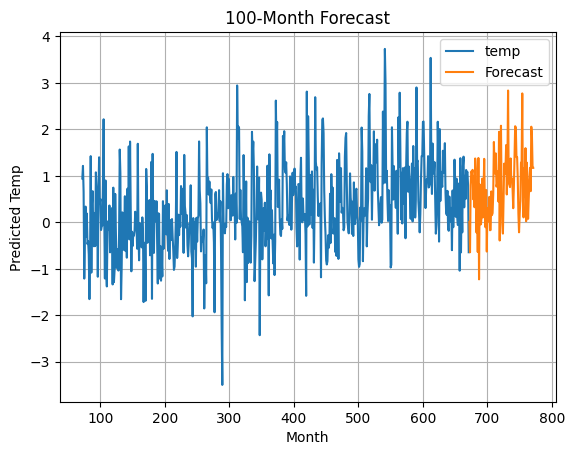

# Analysis and predictions of climate trends in the US using machine learning
## Skills
ML: XGBoost, Walk-Forward Validation 
Python: Pandas, Matplotlib 
Analysis: Time-Series Analysis, Time-Series Forecasting,  Data Visualization

## Executive Summary
An increase in global temperatures hs been observed.
Using Python and XGBoost, I cleaned and examined the trends in temperature change for the US.
I trained an ML model to predict future increases.
Changes in temperature will not only continue, but accelerate.
I recommend steps be taken now to mitigate the effects of temperature change on the electrical grid:
1. Invest early in infrastructure to handle future demands
1. Explore alternative energy sources to bring down the cost of future upgrades

## Business Problem
How can accurate temperature forecasting improve energy demand planning and climate risk mitigation strategies for utility companies or government agencies?
Stakeholders such as utility companies, grid operators, and climate policy analysts can use these forecasts to inform operational and strategic decisions.

## Methodology
1. Performed **exploratory data analysis** (EDA) on a word-wide temperature data set.
    - **Cleaned** and **visualized** the data, and selected the subset of information from the US.
    - Aggregated year-by-year and month-by-month and observed an overall trend increasing high, low, and average temperature.
1. Trained **XGBoost** on the data using **walk-forward validation** to accurately model **time-series data**.
    - Achieved a **root-mean-squared error** (RMSE) of 0.15 degrees celsius.
    - This level of accuracy enables more confident planning around seasonal energy demand and climate resilience.

## Results & Business Recommendations:
We observe a clear, accelerating trend in the climate data from 1961 - 2019.
According to this model, the trend will continue into the foreseeable future.
Energy demands are strongly correlated with increasing temperature: clients will use more A/C to cool down their business and houses.
We can take proactive steps to ensure the grid is robust enough to handle these projected increases in load.
I recommend we invest early in alternative technologies like wind and solar to help reduce our carbon footprint and drive down the cost of future investments in the grid.

## Next Steps
1. Explore correlations in historical data between changes in temperature and consumer usage
1. Examine current loads on the grid and determine future impacts on reliability
1. Perform a cost analysis to determine the best way to meet future demands